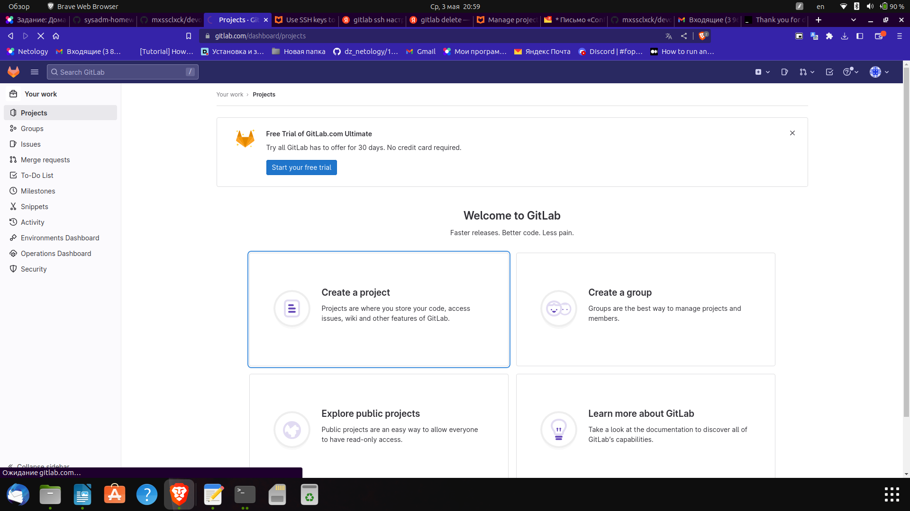
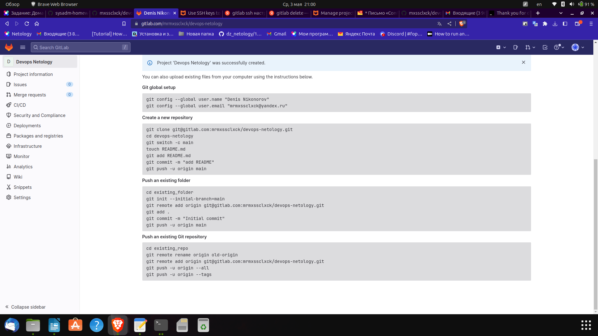
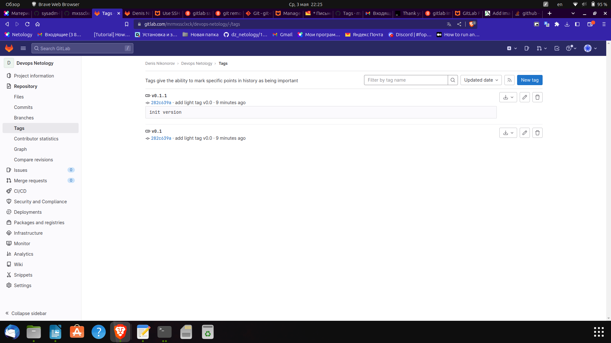
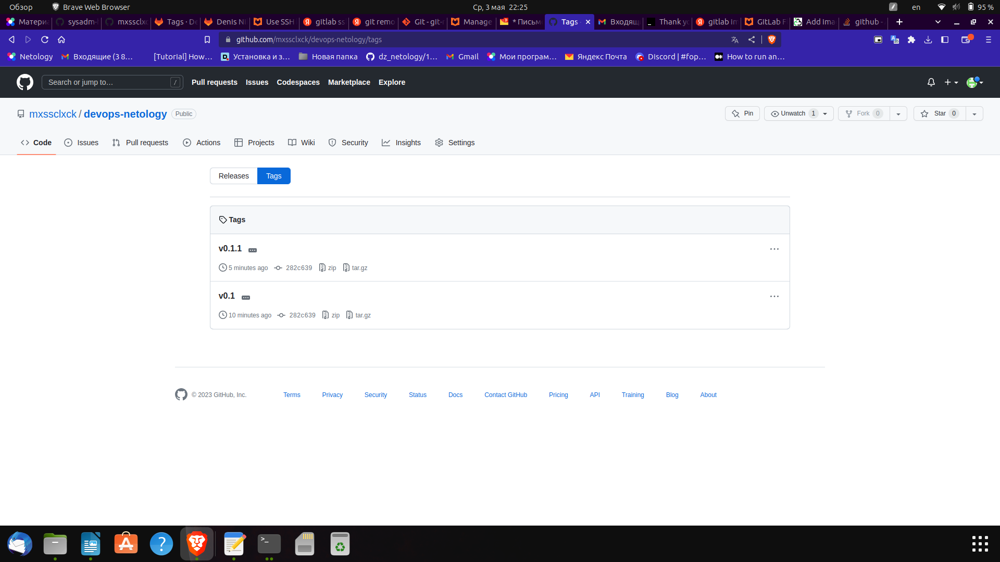

# devops-netology
# Домашнее задание к занятию «Основы Git» - Никоноров Денис - FOPS-6

## Задание 1.

После регистрации или авторизации в GitLab создайте новый проект, нажав на ссылку Create a projet. 
Желательно назвать также, как и в GitHub — devops-netology

Перейдите на страницу созданного вами репозитория, URL будет примерно такой: https://gitlab.com/YOUR_LOGIN/devops-netology.
Изучите предлагаемые варианты для начала работы в репозитории в секции Command line instructions.

Запомните вывод команды git remote -v.
Из-за того, что это будет наш дополнительный репозиторий,
ни один вариант из перечисленных в инструкции (на странице вновь созданного репозитория) нам не подходит.
Поэтому добавляем этот репозиторий, как дополнительный remote,
к созданному репозиторию в рамках предыдущего домашнего задания:
 git remote add gitlab git@gitlab.com:mrmxssclxck/devops-netology.git.
Отправьте изменения в новый удалённый репозиторий git push -u gitlab main.
Обратите внимание, как изменился результат работы команды git remote -v.

## Задание 2. Теги

Создайте легковестный тег v0.0 на HEAD-коммите и запуште его во все три добавленных на предыдущем этапе upstream.
Аналогично создайте аннотированный тег v0.1.
Перейдите на страницу просмотра тегов в GitHab (и в других репозиториях) и посмотрите, чем отличаются созданные теги.
в GitHub — https://github.com/YOUR_ACCOUNT/devops-netology/releases;
в GitLab — https://gitlab.com/YOUR_ACCOUNT/devops-netology/-/tags;

Легковестный тег у меня v0.1, а аннотированный v0.1.1

Как выглядят теги в GitLab

И Github

